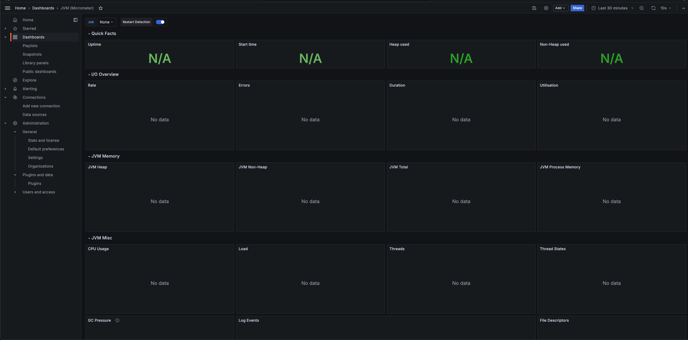
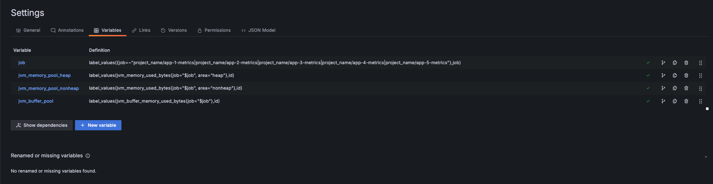
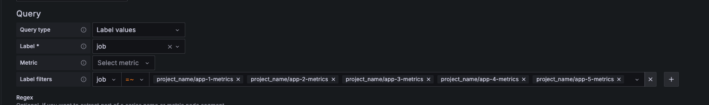
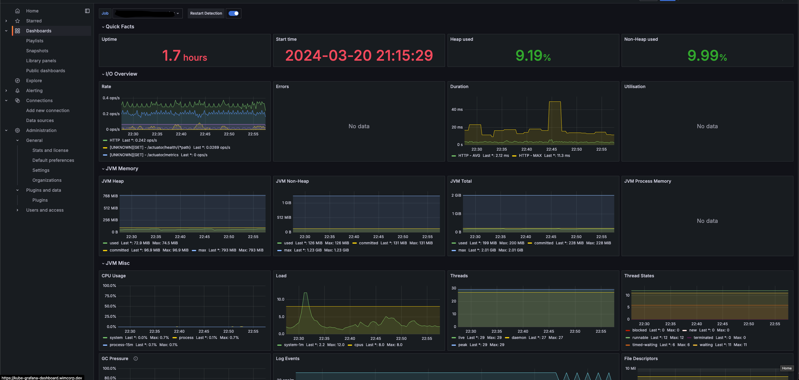

# k8s-monitor

## SetUp

### Helm Repo

```sh
helm repo add grafana https://grafana.github.io/helm-charts
helm repo update
```

### Loki

```sh
kubectl create ns loki
helm upgrade --install loki grafana/loki -f loki-values.yaml -n loki
```

### Mimir

```sh
kubectl create ns mimir
helm upgrade --install mimir grafana/mimir-distributed -n mimir
```

### Grafana

```sh
kubectl create ns monitoring
helm upgrade --install grafana grafana/grafana -f grafana-values.yaml -n monitoring
```

#### import k8s jvm dashboard template

monitoring 디렉토리 안에있는 dashboard.json 을 import 한다.

> <https://grafana.com/grafana/dashboards/4701-jvm-micrometer/>
> 위 템플릿을 기반으로 수정한 템플릿이다.
>
> - angular 기반의 컴포넌트 마이그레이션
> - 애플리케이션의 별도의 Bean 혹은 설정 제거
> - grafana agent 에서 등록한 job_name 기반 필터링



위와같이 import 된다. job을 등록해줘야한다.




변수 job 에서 본인 프로젝트의 애플리케이션 명으로 적절히 수정한다.


