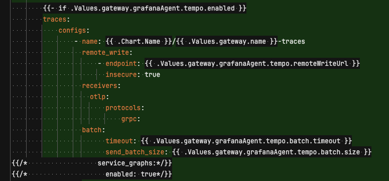

# k8s-monitor

## SetUp

### Helm Repo

```sh
helm repo add grafana https://grafana.github.io/helm-charts
helm repo update
```

---

### Loki

```sh
kubectl create ns loki
helm upgrade --install loki grafana/loki -f monitoring/loki-values.yaml -n loki
```

---

### Mimir

```sh
kubectl create ns mimir
helm upgrade --install mimir grafana/mimir-distributed -n mimir
```

---

### Tempo

```sh
kubectl create ns tempo
helm upgrade --install tempo grafana/tempo-distributed -f monitoring/tempo-values.yaml -n tempo
```

#### service-graphs

tempo 의 서비스 그래프 기능을 이용하려면 별도의 설정이 필요하다.
현재 metrics, logs, traces 등 다양한 지표를 그라파나 에이전트 를 통해 수집하고 있다.
[문서](https://grafana.com/docs/tempo/latest/configuration/grafana-agent/service-graphs/)를 보면 그라파나 에이전트에서
서비스 그래프를 활성화하는 방법을 안내하고 있는데



service_graphs 를 enable 이 필요하다고 한다.
하지만 위 설정은 필요없었고, tempo 의 metricsGenerator 를 사용해 서비스 그래프를 위한 데이터를 푸시할 수 있었다.

[tempo-values.yaml](monitoring/tempo-values.yaml)

```yaml
metricsGenerator:
  enabled: true
  config:
    storage:
      remote_write:
        - url: http://mimir-nginx.mimir.svc.cluster.local:80/api/v1/push
          send_exemplars: false

global_overrides:
  metrics_generator_processors:
    - service-graphs
```

위 설정을 통해 tempo 의 metricsGenerator 를 활성화하고, mimir(prometheus)에 데이터를 푸시하도록 설정했다.

그리고, 그라파나의 tempo 데이터소스에서 아래와 같이 service graph 의 데이터소스로 mimir(prometheus)를 설정한다.


---

### Grafana

```sh
kubectl create ns monitoring
helm upgrade --install grafana grafana/grafana -f monitoring/grafana-values.yaml -n monitoring
```

#### import k8s jvm dashboard template

monitoring 디렉토리 안에있는 dashboard.json 을 import 한다.

> <https://grafana.com/grafana/dashboards/4701-jvm-micrometer/>
> 위 템플릿을 기반으로 수정한 템플릿이다.
>
> - angular 기반의 컴포넌트 마이그레이션
> - 애플리케이션의 별도의 Bean 혹은 설정 제거
> - grafana agent 에서 등록한 job_name 기반 필터링


위와같이 import 된다. job을 등록해줘야한다.


변수 job 에서 본인 프로젝트의 애플리케이션 명으로 적절히 수정한다.


#### grafana agent `too many open files` 에러

```sh
sudo sysctl -w fs.inotify.max_user_instances=512
```

128 -> 512
